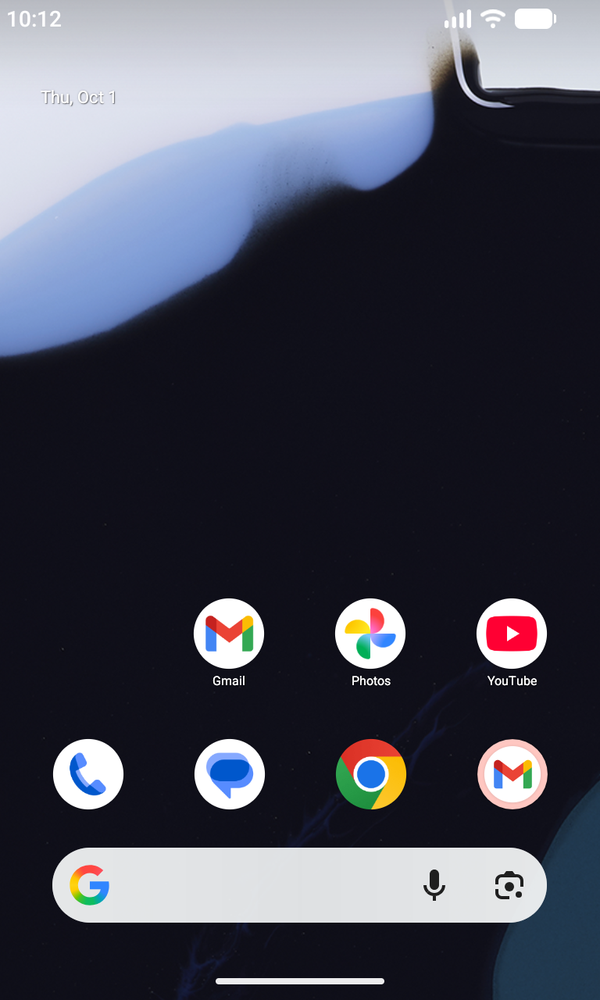
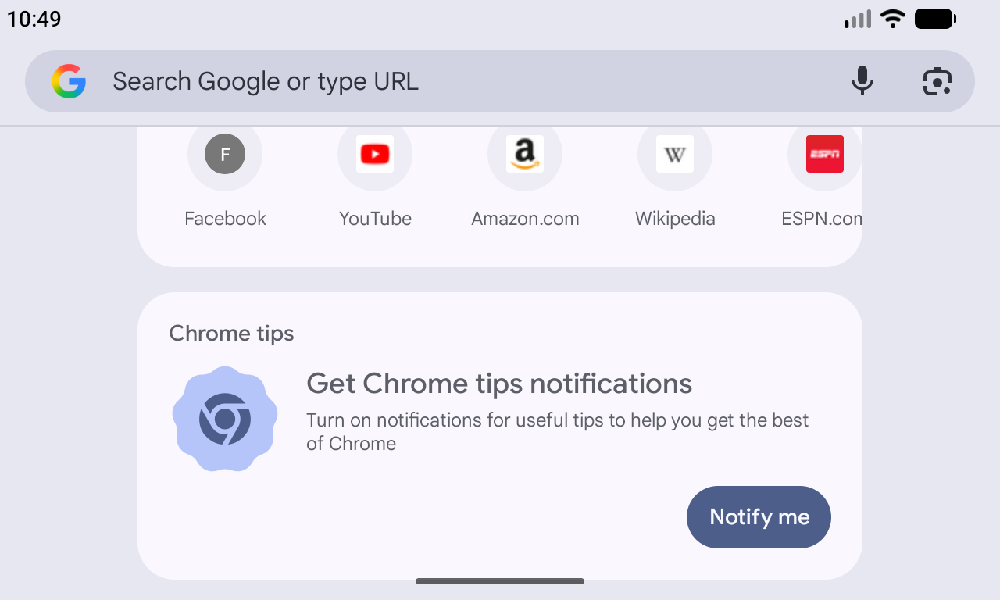
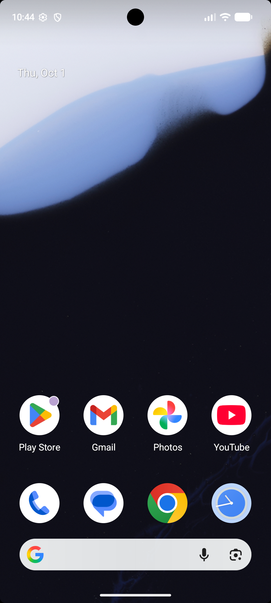
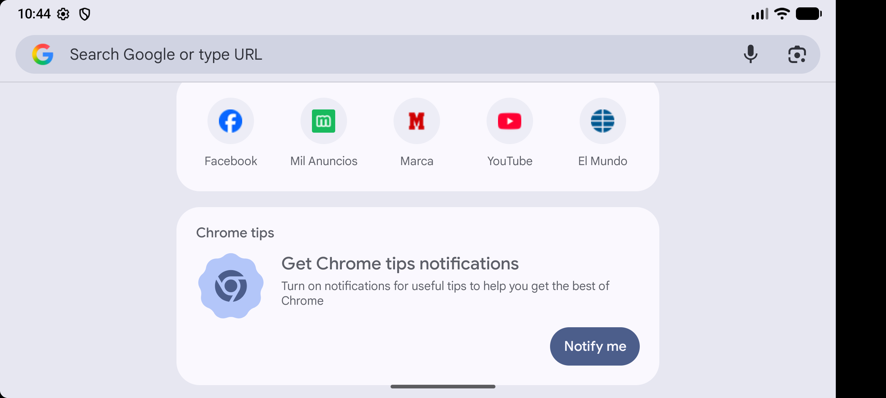
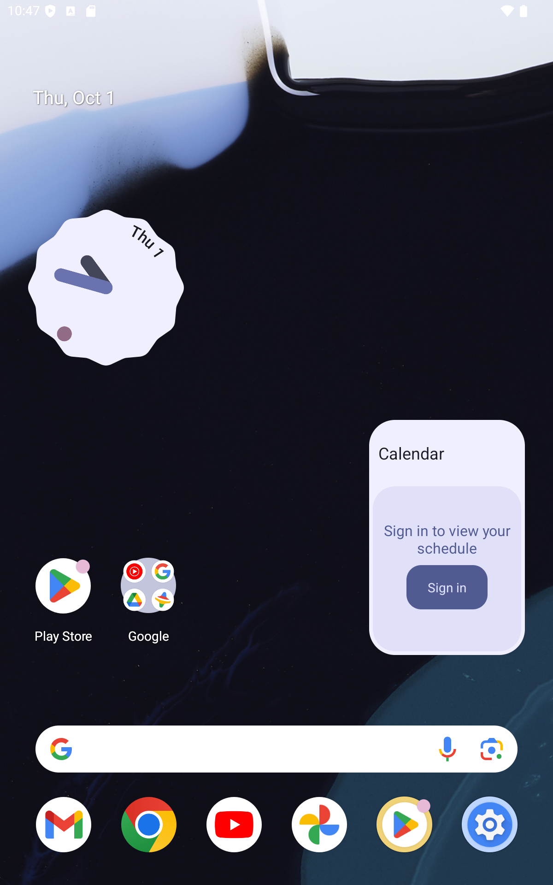
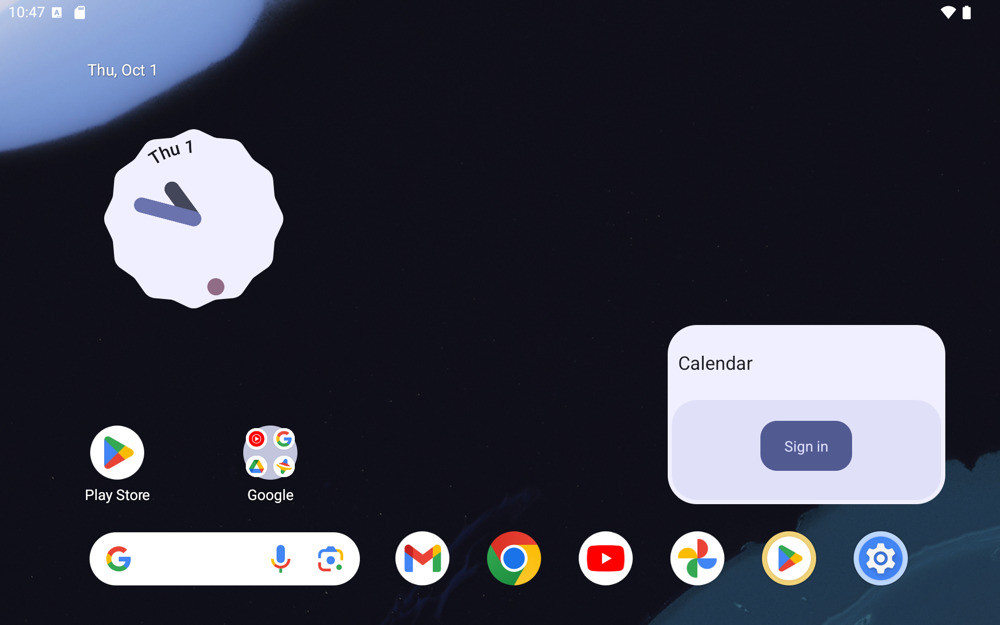

Teléfono pequeño antiguo, Nexus 4

Vertical:

Horizontal:

Características:
- Perfil: Nexus 4
- API: 37.2
- Densidad: 320dpi 
- Resolución: 768x1280

Teléfono actual, Pixel 7

Vertical:

Horizontal:

Características:
- Perfil: Nexus 4
- API: 37.2
- Densidad: 420dpi
- Resolución: 1080x2400

Tablet, Small Tablet

Vertical:

Horizontal:

Características:
- Perfil: Small Tablet
- API: 35
- Densidad: 320dpi
- Resolución: 1920x1200

Entre los dos teléfonos las diferencias son de espacio y tamaño de la pantalla, entre la tablet y 
los teléfonos la tablet ofrece opciones específicas de ese dispositivo como firmar en el navegador
y tambien diferencias con tamaños de iconos y distribución