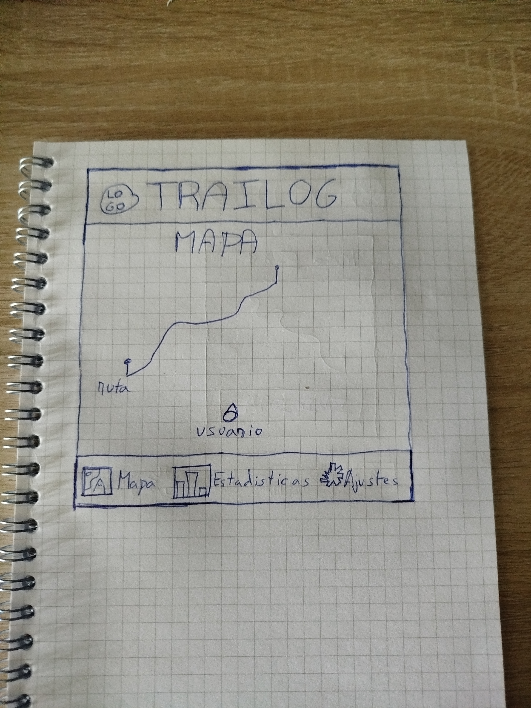
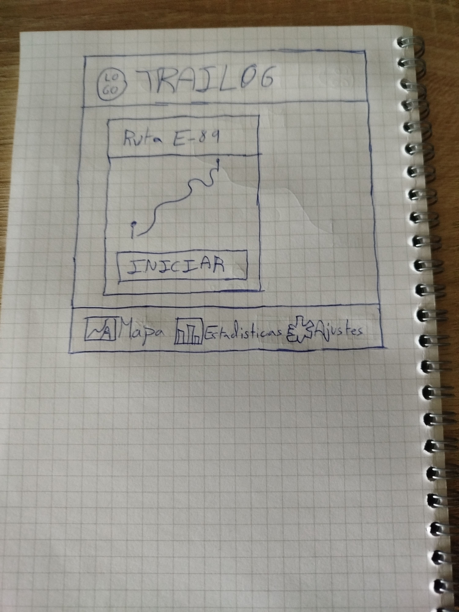
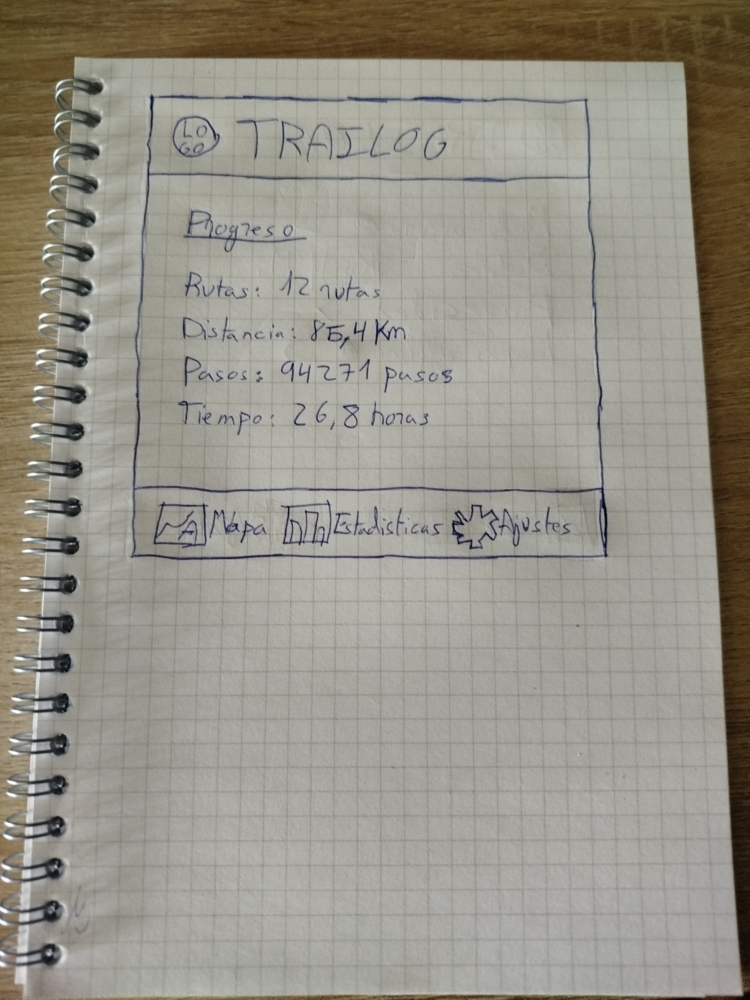
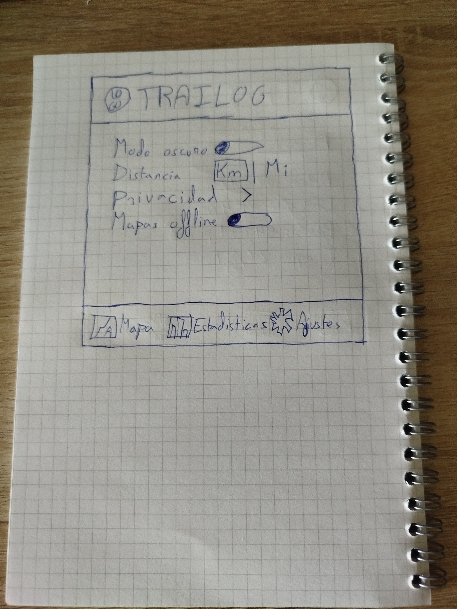

# Plantilla: propuesta del Proyecto A

---

## 0 · Datos

|                      |                       |
|----------------------|-----------------------|
| **Nombre de la app** | Trailog               |
| **Autor/a**          | Alejandro Aballe Peña |
| **Fecha**            | 01/10/2026            |

---

## 1 · La idea en una frase

> Qué hace tu app y para quién, en una sola frase.
Una app que permite a aficionados al senderismo consultar rutas, registrar sus excursiones y 
consultar estadísticas sobre su actividad

---

## 2 · El problema

> ¿Qué problema resuelve? ¿Cómo se resuelve hoy sin tu app?
No disponer de un lugar sencillo donde consultar rutas y registrar y conservar la información de las
excursiones realizadas. Actualmente esto se puede hacer mediante aplicaciones de senderismo ya 
existentes, anotando los datos manualmente o simplemente confiando en la memoria
---

## 3 · Personas usuarias

> ¿Quién la va a usar? Describe a una persona concreta: edad, soltura con la
> tecnología, cuándo y dónde abre la app, cuánto tiempo le dedica y qué pasa
> si le falla.
Una persona de 20 años aficionada al senderismo, con cierta soltura utilizando aplicaciones móviles.
Utilizaría la aplicación antes de una ruta para consultar información sobre ella, durante la ruta 
para consultar su posición y registrar su progreso, y después para consultar los datos de la
actividad realizada
El usuario podria dedicarle desde 1 minuto para ver estadisticas hasta 10 minutos para informarse 
sobre rutas senderisticas cercanas
Si la app le falla una vez en ruta no deberia ser una molestia ya que se debería guardar información
en el dispositivo para poder usarlo sin conexión, sobre las estadisticas podría ser un problema si
el dispositivo se queda sin conexión ya que no podría obtener su localización y no saber en que 
punto de la ruta está

---

## 4 · Funcionalidades

### Imprescindibles (sin esto la app no tiene sentido)

| #  | Funcionalidad                                                                                        |
|----|------------------------------------------------------------------------------------------------------|
| F1 | Consultar un mapa de la zona y visualizar la ubicación actual del usuario                            |
| F2 | Registrar una ruta mientra se realiza una excursión, mostrando el recorrido realizado sobre  el mapa |
| F3 | Contar los pasos realizados durante la ruta y mostrar el número al usuario                           |

### Opcionales (si sobra tiempo)

| #                      | Funcionalidad                                                                                                      |
|------------------------|--------------------------------------------------------------------------------------------------------------------|
| O1                     | Iniciar un cronómetro para conocer la duración de la ruta                                                          |
| O2                     | Calcular una estimación del tiempo neceario para completar la ruta a partir de la distancia y el ritmo del usuario |

---

## 5 · Pantallas

| Pantalla         | Para qué sirve                                           | Se llega desde |
|------------------|----------------------------------------------------------|----------------|
| Mapa             | Visualizar la ubicación del usuario y ver rutas          | (arranque)     |
| Información ruta | Información de la ruta seleccionada en el mapa           | Mapa           |
| Informacion      | Información relacionada con las estadisticas del usuario | Mapa           |
| Ajustes          | Ajuste relacionados con las preferencias del usuario     | Mapa           |

---

## 6 · Bocetos

> Dibuja las pantallas principales. A mano y fotografiado es válido.
> Pega aquí las imágenes o indica el nombre de los archivos adjuntos.
Mapa: 
Información ruta: 
Información: 
Ajustes: 
---

## 7 · Qué datos guarda la app

| Tipo de dato | Campos                                 | Ejemplo                                                            |
|--------------|----------------------------------------|--------------------------------------------------------------------|
| Ruta         | Nombre, Distancia, Recorrido           | E-89, 50Km, [(42.18, -8.72), (42.19, -8.73), (42.20, -8.74), ...]  |
| Actividad    | Ruta, Fecha, Duración(segundos), Pasos | E-89, 01/01/2026, 9540, 15000                                      |
| Fotografía   | Ruta, Fecha, Imagen                    | E-89, 01/01/2026, /res/img/imagen.jpg                              |
---

## 8 · Encaje con los requisitos del módulo

> Apartado obligatorio: ninguna casilla puede quedar vacía.

| Requisito                                                             | Dónde encaja en tu app                                                                                           | Tema |
|-----------------------------------------------------------------------|------------------------------------------------------------------------------------------------------------------|------|
| **Persistencia de datos** — la información sobrevive al cerrar la app | Guarda las rutas realizadas, estadisticas del usuario y pasos realizados                                         | 4    |
| **Servicio web** — la app consulta datos por internet                 | Obtener mapas mediante una api o un servicio web gratuito                                                        | 5    |
| **Sensor o localización**                                             | Uso de la localización GPS para situar al usuario en el mapa y registrar el recorrido realizado durante la ruta. | 6    |
| **Contenido multimedia** — foto, audio, vídeo o animación             | Permitir asociar fotografías a las rutas por parte del usuario                                                   | 7    |

---

## 9 · Riesgos

| Lo que me preocupa                                                                                                       | Plan B                                                                                                                              |
|--------------------------------------------------------------------------------------------------------------------------|-------------------------------------------------------------------------------------------------------------------------------------|
| Que la API de mapas resulte demasiado complicada de integrar o tenga limitaciones de uso                                 | Utilizar una API alternativa o, si fuese necesario, mostrar mapas y rutas de ejemplo almacenados localmente en la aplicación.       |
| Que el registro de la ubicación y del recorrido consuma demasiada batería o presente problemas cuando no haya cobertura. | Reducir la frecuencia de actualización de la ubicación y permitir utilizar previamente descargados los mapas de la zona de la ruta. |
| Que la gestión de los sensores y el contador de pasos resulte más complicada de lo previsto.                             | Mantener el registro de la ruta mediante GPS y, si es necesario, convertir el contador de pasos en una funcionalidad opcional.      |

---

## Antes de entregar

- [ ] La idea cabe en una frase.
- [ ] El público es una persona concreta, no «todo el mundo».
- [ ] Hay **3 o 4** funcionalidades imprescindibles, no diez.
- [ ] Cada funcionalidad imprescindible tiene su pantalla.
- [ ] Hay bocetos de las pantallas principales.
- [ ] **Las cuatro casillas del apartado 8 están rellenas.**
- [ ] Está identificado al menos un riesgo con su plan B.
